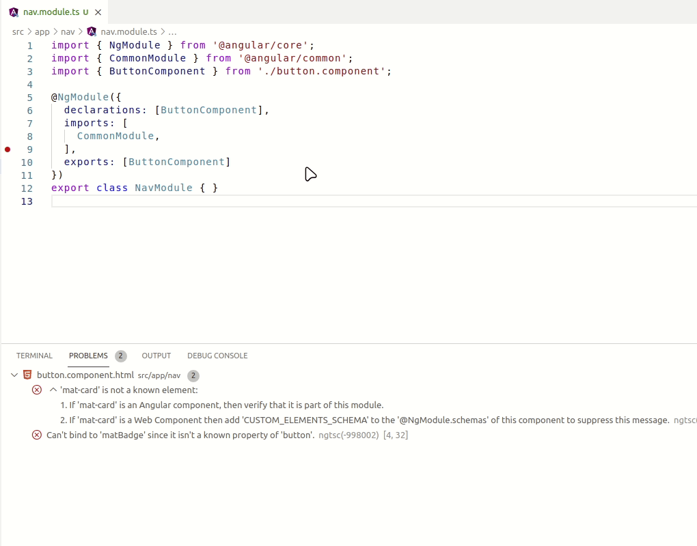

# ng-error-fixer-vscode - vscode extension

Fix common angular's errors by calling to ng-error-fixer CLI on vscode

## Features

As soon vscode diagnostics API send to [ng-error-fixer cli](https://github.com/LuisReinoso/ng-error-fixer) the error. It will fix the following errors

- Fix [NG8001: Invalid Element](https://angular.io/errors/NG8001)
- Fix [NG8002: Invalid Attribute](https://angular.io/errors/NG8002)

## Requirements

- `npm install -g ng-error-fixer`
- `npm install -D unknown-html-schematics`

## Extension Settings

This extension contributes the following settings:

* `ng-error-fixer.background`: Run autofix mode of ng-error-fixer cli

## Release Notes

Check [Changelog file](./CHANGELOG.md)

## Development

- Fork and clone this repo
- `cd ng-error-fixer-vscode`
- `npm install`
- Add feature/fix
- `npm run test`
- If all is ok. Send a PR!

## License

Luis Reinoso 2021 [MIT license](LICENSE)